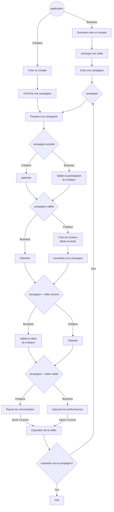

```mermaid
graph TD
    o((application)) -->|Business| BA
    o((application)) -->|Créateur| CA
    BA[Business crée un compte] --> BB[recharge son solde]
    BB --> BC[Crée une campagne]

    CA[Crée un compte] --> CB[Cherche une campagne]
    CB --> CE[Postuler à la campagne]

    BC --> BD{campagne}
    BD --> CE

    CE --> BDP{campagne postulé}

    BDP -->|Créateur| patienter
    patienter --> BF


    BDP --> |Business| BE[Valide la participation 
    du créateur]
    BE --> BF{campagne validé}
   
    BF -->|Business| BG[Patienter]
    BG -->BH

    BF -->|Créateur| CD[Crée du contenu 
    tiktok et poste]
    CD --> CF[soumettre à la campagne]
    CF --> BH{campagne + vidéo soumis}

     BH ---> |Business| BI[Valide la vidéo 
    du créateur]
    BI --> BJ{campagne + vidéo validé}

     BH --> |Créateur| CG[Patiente]

     CG --> BJ

     BJ--> |Business| BK[Aperçois les performances]
     BJ--> |Créateur| CH[Reçois les rémunération]

     CH & BK -->|Après 14 jours| CBK[Expiration de la vidéo]

     CBK --> CBL{expiration de la campagne?} -->|Non| BD
     CBL -->|Oui| FIN
```